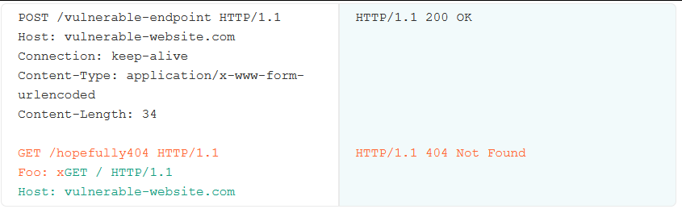

# CL.0

Request smuggling zaifliklari bir biriga ulangan tizimlar har bir so'rovning qayerda boshlanishi va tugashini aniqlashdagi tafovutlar natijasidir. Bu, odatda [mos kelmaydigan header parsing](../http-request-smuggling/#qanday-qilib-http-request-smuggling-zaifliklari-vujudga-keladi)-iga bog'liq bo'lib , bir server requestning`Content-Length`-idan foydalanishiga, ikkinchisi esa xabarni chunked sifatida ko'rib chiqishga olib keladi. Biroq, bir xil hujumlarni ushbu muammolardan biriga tayanmasdan amalga oshirish mumkin.

Ba'zi hollarda, serverlarni `Content-Length` headeriga e'tibor bermaydigan qilish mumkin, ya'ni ular har bir request headerlar oxirida tugaydi deb hisoblaydigan bo'ladi. Bu deyarli `Conten-Length`-ni 0 deb hisoblash bilan bir xil.

Agar back-end server bu xatti-harakatni namoyon qilsayu lekin front-end `Content-Length` request qayerda tugashini aniqlash uchun headerdan foydalansa, HTTP requestni yashirin olib o'tish uchun bu nomuvofiqlikdan foydalanishingiz mumkin. Biz buni “CL.0” zaifligi deb atashga qaror qildik.

## CL.0 zaifliklari uchun sinov 

CL.0 zaifliklarini tekshirish uchun avval boshqa so'rovning bir qismini o'z ichiga olgan so'rovni yuboring, keyin ortidan oddiy so'rovini yuboring. Shundan so'ng, keyingi so'rovga smuggling prefiksi ta'sir qilganligini tekshirishingiz mumkin.

Quyidagi misolda bosh sahifa uchun keyingi so'rov 404 ta javob oldi. Bu shuni ko'rsatadiki, backend server POST so'rovining asosiy qismini (GET  /hopefully404...) boshqa so'rovning boshlanishi sifatida talqin qilgan.

Eng muhimi, biz headerlarni hech qanday o'zgartirmaganimizga e'tibor bering - so'rovning uzunligi mutlaqo normal, to'g'ri `Content-Length` header bilan belgilanadi.

Burp Repeater yordamida buni o'zingiz sinab ko'rish uchun:

1. Sozlash requestini o'z ichiga olgan bitta tab va keyingi o'zboshimcha requestni o'z ichiga olgan boshqa tab yarating.
2. Ikkila tabni to'g'ri tartibda guruhga qo'shing.
3. **Send** tugmasi yonidagi drop-down menyudan foydalanib, yuborish rejimini **Send group in sequence (single connection)** ga o'zgartiring .
4. `Connection` headerini  `keep-alive` ga o'zgartiring.
5. Ketma-ketliklarni yuboring va responselarni tekshiring.

Biz bu xatti-harakatni asosan `POST` request kutilmaydigan endpointlarda ko'p kuzatganmiz, shuning uchun ular hech qanday requestning tanasi yo'q deb bilvosita taxmin qilishadi. Server darajasidagi redirectlarni va statik fayllar uchun reqestlarni ishga tushiradigan endpointlar asosiy nomzodlardir.

## CL.0 xatti-harakatlarini aniqlash 

Agar zaif ko'rinadigan endpointlarni topa olmasangiz, o'rniga buni keltirib chiqarishga urinib ko'rishingiz mumkin.

Request headerlari server xatosini yuzaga keltirganda, ba'zi serverlar request tanasini socketni yopmasdan xato responseni qabul qiladi. Agar ular keyinroq ulanishni yopmasa, bu muqobil CL.0 sinxronlash vektorini taqdim etishi mumkin.

Bundan tashqari `Content-Length` headeri obfuskatsiya qilingan `GET` requestlaridan urinib ko'rishingiz mumkin. Agar siz buni front-enddan emas, balki back-end serverdan yashira olsangiz, bu ham desinxronizatsiyani keltirib chiqarishi mumkin. TE.TE request smugglingni o'rgatganimizda [headerni obfuskatsiya qilish](../http-request-smuggling/topish) usullarini ko'rib chiqdik.

## CL.0 zaifliklaridan foydalanish 

CL.0 zaifliklarini avvalroq [request smugglingdan foydalanish](../http-request-smuggling/foydalanish) sahifasida o'rganganimizdek bir xil server tomondagi request smuggling hujumlari uchun foydalanishingiz mumkin. Quyidagi laboratoriyada buni o'zingiz sinab ko'ring.

:::caution **Lab:** 
[CL.0 request smuggling ≫](https://portswigger.net/web-security/request-smuggling/browser/cl-0/lab-cl-0-request-smuggling)
:::

## H2.0 zaifliklar 

[HTTP/2 soʻrovlarini HTTP/1 ga tushiradigan ](../advanced-request-smuggling/http-2-downgrade)veb-saytlar, agar server `Content-Length` headeri downgrade qilingan request headeriga e'tibor qilmasa “H2.0” muammosiga qarshi himoyasiz boʻlishi mumkin .

## CL.0 zaifliklarini qanday oldini olish mumkin 

CL.0 zaifliklari va desinxronlash hujumining boshqa shakllarini oldini olish uchun qilishingiz mumkin bo'lgan yuqori darajali ba'zi choralarni o'rganish uchun [HTTP request smuggling zaifliklarni qanday oldini olish mumkin](../http-request-smuggling/#qanday-qilib-http-request-smuggling-zaifliklarini-oldini-olish-mumkin) nomli mavzuni o'qing.

:::info Ma'lumot
Bir qator reqeust smuggling hujumlarining client-side oʻzgarishlarini amalga oshirish uchun ushbu boʻlimda oʻrgangan bilimlaringizni oshirishingiz mumkin. Buni qanday qilishni o'rganish uchun [Client-side desync attacks](client-side-desync) ga o'ting.
:::

